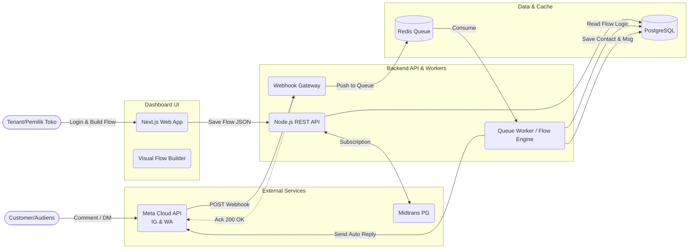

# Yucano Labs Architecture

## Purpose
Arsitektur Yucano Labs dirancang dengan fokus pada **reliability (keandalan)**, **scalability terhadap lonjakan traffic**, dan **kemudahan penggunaan**. Mengingat sistem ini bergantung pada *webhook* eksternal dari Meta (Instagram & WhatsApp), sistem harus menjamin bahwa setiap pesan atau komentar yang masuk ditangkap dan direspons secara *real-time* (acknowledgement di bawah 3 detik) tanpa kehilangan *leads*. Arsitektur ini juga mengoptimasi pemisahan antara pemrosesan antrean *background* dan UI interaktif (Flow Builder) untuk memastikan kegagalan di satu sisi tidak membuat sistem *down* sepenuhnya.

## High-Level Architecture
Sistem menggunakan topologi terpisah antara antarmuka pengguna (Dashboard/Builder) dan mesin pemroses pesan (Webhook & Worker) untuk memisahkan beban *read-heavy* dan *write-heavy*.



## Architectural Goals
*   **Decoupled Webhook Processing:** Meta mewajibkan *endpoint webhook* merespons HTTP 200 dalam beberapa detik. Oleh karena itu, *receiver* hanya bertugas menerima payload dan memasukkannya ke *Message Queue* (Redis), sedangkan pemrosesan balasan (menjalankan rule-bot) dilakukan oleh *Worker* secara terpisah.
*   **Thin Frontend, Smart Backend:** Frontend hanya bertugas memvisualisasikan interaksi (Node & Edge) dan mengubahnya menjadi format JSON terstruktur. Backend yang memvalidasi dan mengeksekusi logika JSON tersebut.
*   **Strict Data Isolation (Multi-tenant):** Semua entitas di database wajib memiliki kunci relasi langsung atau tidak langsung ke `tenant_id` untuk mencegah kebocoran data antar toko online.
*   **Stateless Services:** Aplikasi backend bersifat *stateless* sehingga dapat dengan mudah di-*scale up/out* secara horizontal saat terjadi lonjakan trafik (misalnya saat konten kreator menjadi viral).

## Stack
*   **Frontend:**
    *   Framework: Next.js (React)
    *   Flow Builder: React Flow
    *   Styling: TailwindCSS + Shadcn UI
    *   State Management: Zustand
*   **Backend:**
    *   Framework: Node.js dengan NestJS (atau Express)
    *   Job Queue: BullMQ (berbasis Redis)
    *   API Client: Axios / Node Fetch untuk Meta API
*   **Persistence:**
    *   Database: PostgreSQL (Relational)
    *   ORM: Prisma ORM
    *   Cache & Message Broker: Redis

## System Boundaries
*   **Frontend:** Tidak boleh menyimpan *credentials* pihak ketiga (Meta Access Token). Hanya menangani autentikasi sesi pengguna, merender UI (Flow Builder & Live Inbox), dan meneruskan perintah ke Backend.
*   **Backend:** Menjadi satu-satunya pihak yang berkomunikasi dengan API Meta dan Payment Gateway. Bertanggung jawab memverifikasi *signature/hash* dari *webhook* Meta untuk memastikan data sah. Menangani seluruh enkripsi token akses.
*   **Database/Cache:** PostgreSQL menjadi *Single Source of Truth* untuk konfigurasi *flow*, data kontak, dan riwayat *chat*. Redis bertindak murni sebagai antrean (*ephemeral data*) dan *caching limit*.

## Request Flow
Alur utama penerimaan pesan (Comment-to-DM) dari Customer hingga dibalas oleh Bot Yucano:
1.  **Customer Trigger:** Customer berkomentar "MAU" di Reels Instagram Tenant.
2.  **Meta Webhook:** Server Meta mengirimkan HTTP POST *payload* ke endpoint `/api/webhooks/meta` Yucano.
3.  **Authentication & Acknowledge:** Webhook Receiver memvalidasi HMAC SHA256 *signature* payload. Jika valid, payload didorong ke Redis Queue (`incoming-messages`), dan server langsung merespons `HTTP 200 OK` ke Meta.
4.  **Queue Consumption:** BullMQ Worker mengambil *job* dari antrean Redis.
5.  **Rule Evaluation:** Worker membaca `tenant_id` dari payload, memeriksa database apakah Tenant memiliki *flow* aktif untuk pemicu "Comment-to-DM" dengan kata kunci "MAU".
6.  **Action Execution:** Jika cocok, Worker membaca JSON spesifikasi Flow, merangkai pesan balasan (misal: "Cek DM kak"), dan melakukan HTTP POST ke Meta Graph API untuk mengirimkan DM.
7.  **State Persistence:** Worker mencatat Customer ke tabel `Contact` dan menyimpan pesan ke tabel `MessageHistory` (untuk ditampilkan di Live Inbox Dashboard).

## Frontend App Layer
Arsitektur frontend dipusatkan pada pengalaman membuat alur bot yang mulus. Menggunakan Zustand untuk menyimpan *state* dari React Flow agar tetap reaktif.

**Struktur Direktori Konseptual:**
*   `src/components/flow-builder/` -> Komponen kanvas, kustom Node (Teks, Gambar, Tombol), dan Edge.
*   `src/components/inbox/` -> UI untuk omnichannel chat.
*   `src/store/` -> Manajemen state global.

**Potongan Kode (Zustand State untuk Flow Builder):**
```ts
import { create } from 'zustand';
import { addEdge, applyNodeChanges, applyEdgeChanges } from 'reactflow';

interface FlowState {
  nodes: Node[];
  edges: Edge[];
  onNodesChange: (changes: NodeChange[]) => void;
  onEdgesChange: (changes: EdgeChange[]) => void;
  onConnect: (connection: Connection) => void;
  saveFlow: () => Promise<void>;
}

export const useFlowStore = create<FlowState>((set, get) => ({
  nodes: [],
  edges: [],
  onNodesChange: (changes) => {
    set({ nodes: applyNodeChanges(changes, get().nodes) });
  },
  onEdgesChange: (changes) => {
    set({ edges: applyEdgeChanges(changes, get().edges) });
  },
  onConnect: (connection) => {
    set({ edges: addEdge(connection, get().edges) });
  },
  saveFlow: async () => {
    const { nodes, edges } = get();
    const payload = JSON.stringify({ nodes, edges });
    await fetch('/api/flows', { method: 'POST', body: payload });
  }
}));
```

## Backend Orchestration Layer
Backend memisahkan antara REST API yang melayani interaksi Dashboard, dan *Worker process* yang bekerja di balik layar mengeksekusi logika bot.

**Struktur Direktori Konseptual:**
*   `src/api/` -> Endpoint untuk Dashboard (CRUD Flows, Contacts, Inbox).
*   `src/webhooks/` -> Endpoint khusus, dioptimalkan untuk kecepatan (hanya validasi & enqueue).
*   `src/workers/` -> Konsumen BullMQ, mengeksekusi logika *rule-based* AI.
*   `src/services/` -> Integrasi Meta API & Midtrans.

**Potongan Kode (BullMQ Worker Setup):**
```ts
import { Worker, Job } from 'bullmq';
import { FlowEngine } from '../services/FlowEngine';
import { MetaAPI } from '../services/MetaAPI';

// Pekerja di background yang memproses antrean pesan
export const messageWorker = new Worker('incoming-messages', async (job: Job) => {
  const { tenantId, platform, messageContent, senderId } = job.data;
  
  // 1. Cek mode Live Inbox (apakah bot sedang di-pause?)
  const isPaused = await FlowEngine.checkIfPaused(tenantId, senderId);
  if (isPaused) return; 

  // 2. Evaluasi Keyword / Trigger
  const activeFlow = await FlowEngine.findMatchingFlow(tenantId, messageContent);
  if (!activeFlow) return;

  // 3. Eksekusi Graph/Node dan panggil Meta API
  const responsePayload = await FlowEngine.executeNode(activeFlow.startNodeId);
  await MetaAPI.sendMessage(platform, senderId, responsePayload);

}, { connection: { host: process.env.REDIS_HOST, port: 6379 } });
```

## Rule-Based Execution Strategy
Karena kita menghapus sistem LLM (AI) pada tahap MVP ini, tantangan terbesarnya adalah mengeksekusi *flow* berbasis JSON yang dibuat di Frontend.
1.  **Parsing JSON Graph:** Setiap *flow* disimpan sebagai Graph (Node memiliki ID, Edge menghubungkan *sourceNodeId* ke *targetNodeId*).
2.  **State Pointer:** Ketika pelanggan merespons bot, sistem memeriksa `ContactState` di database untuk mengetahui posisi pelanggan di Node mana pada flow tersebut.
3.  **Keyword Matching:** Jika pelanggan berada di awal (pemicu), sistem menjalankan regex (pencocokan kata) terhadap teks pesan mereka untuk menemukan Flow yang sesuai.
4.  **Traversing:** Worker mengeksekusi aksi dari Node saat ini (menyimpan data / mengirim pesan), lalu memindahkan *pointer* pelanggan ke `targetNodeId` berikutnya berdasarkan Edge.

## Database/Auth and Backend Communication
*   **Session Management:** Menggunakan *JSON Web Tokens (JWT)* via HTTP-only Cookies untuk Dashboard (Tenant login).
*   **Frontend rules:**
    *   Tidak ada logika eksekusi bot di Frontend.
    *   Wajib melampirkan JWT untuk mengambil data `Inbox` atau menyimpan `Flow`.
*   **Backend rules:**
    *   Semua endpoint mutlak memverifikasi kepemilikan data dengan mencocokkan `tenant_id` pada JWT dengan tabel terkait.
    *   Endpoint Webhook Meta **tidak** menggunakan JWT, melainkan validasi kriptografi (HMAC SHA256) menggunakan `X-Hub-Signature-256` dari Header untuk memastikan request otentik dari server Facebook/Meta.

## Webhook API Contract
Contoh kontrak ketika Meta mengirimkan webhook ke server Yucano:

**HTTP Request:**
*   **Method:** POST `/api/webhooks/meta`
*   **Headers:**
    *   `Content-Type: application/json`
    *   `X-Hub-Signature-256: sha256=[hash_value]`
*   **Request Body (JSON):**
    ```json
    {
      "object": "instagram",
      "entry": [
        {
          "id": "<IG_ACCOUNT_ID>",
          "time": 1234567890,
          "messaging": [
            {
              "sender": { "id": "<CUSTOMER_IG_ID>" },
              "recipient": { "id": "<TENANT_IG_ID>" },
              "message": { "text": "Berapa harganya?" }
            }
          ]
        }
      ]
    }
    ```
*   **Tanggung jawab endpoint:** Memvalidasi `X-Hub-Signature-256` dengan `META_APP_SECRET`, mengekstrak informasi pengirim dan pesan, menyimpannya ke Redis Job Queue, lalu segera mengembalikan `HTTP 200 OK`.

## Data Model
Desain data relasional menggunakan PostgreSQL (representasi Prisma-like):

1.  **Tenant:** Menyimpan profil pengguna berbayar.
    *   `id`, `email`, `name`, `subscription_tier`, `created_at`
2.  **ChannelIntegration:** Kredensial Meta per tenant.
    *   `id`, `tenant_id` (FK), `platform` (IG/WA), `access_token`, `page_id`
3.  **Flow:** Mewakili satu kesatuan alur bot.
    *   `id`, `tenant_id` (FK), `name`, `trigger_type`, `trigger_keyword`, `flow_data` (JSONB - berisi Node & Edge), `is_active`
4.  **Contact:** Prospek/Customer dari tenant.
    *   `id`, `tenant_id` (FK), `platform_user_id`, `name`, `phone`, `email`, `is_bot_paused` (Boolean untuk fitur Live Inbox)
5.  **MessageHistory:** Menyimpan riwayat obrolan untuk ditampilkan di Omnichannel Inbox.
    *   `id`, `contact_id` (FK), `tenant_id` (FK), `direction` (INBOUND/OUTBOUND), `content` (TEXT), `timestamp`

## Schema Management
*   **Migration Tools:** Menggunakan **Prisma Migrate** (`npx prisma migrate dev` / `deploy`).
*   **Workflow:**
    1. Perubahan struktur data dilakukan secara deklaratif di file `schema.prisma`.
    2. Menghasilkan file migrasi SQL lokal dan diuji di environment staging.
    3. Pada tahap CI/CD Pipeline (GitHub Actions), perintah `npx prisma migrate deploy` dijalankan ke database production secara otomatis sebelum kode *backend* versi terbaru dijalankan.

## Multi-Tenant Security Policy
*   **Data Isolation (Invariants):** Semua kueri mutlak harus menyertakan klausa `where: { tenant_id: user.tenantId }`. Developer dilarang membuat API yang mengambil data berdasarkan `id` saja tanpa verifikasi kepemilikan tenant.
*   **Live Inbox Override:** Sistem memiliki aturan absolut bahwa jika atribut `is_bot_paused = true` pada tabel `Contact`, maka Flow Engine (Worker) dilarang keras merespons pesan apapun dari kontak tersebut sampai durasi *pause* berakhir.

## Error Handling
*   **401 Unauthorized:** JWT kadaluarsa atau tidak ada. Frontend meredirect ke halaman Login.
*   **403 Forbidden:** Validasi `X-Hub-Signature-256` dari Meta gagal. Webhook di-drop secara senyap untuk menghindari serangan DDoS/spoofing.
*   **429 Too Many Requests:** Tenant melebihi limit kuota pesan dari paket berlangganannya. Sistem mengirimkan peringatan ke email Tenant.
*   **400 Bad Request (API Meta):** Terjadi jika akun Meta pengguna bermasalah. Worker menangkap error dari Axios, mencatat ke log, dan menghentikan pengulangan (retry) untuk menghindari pemblokiran API.
*   **500 Internal Server Error:** Kegagalan koneksi DB atau Redis. *Global Exception Filter* menangkap error, membungkus pesan rahasia, dan memicu *alert* ke tim *engineer* via Sentry.

## Configuration
**Frontend Settings:**
*   `NEXT_PUBLIC_API_URL`: URL utama dari backend API.
*   `NEXT_PUBLIC_MIDTRANS_CLIENT_KEY`: Kunci publik untuk inisialisasi pop-up pembayaran di sisi klien.

**Backend Settings:**
*   `DATABASE_URL`: Connection string ke PostgreSQL (PgBouncer).
*   `REDIS_URL`: Connection string ke Redis cluster.
*   `META_APP_SECRET`: Rahasia aplikasi Meta untuk verifikasi HMAC webhook.
*   `META_VERIFY_TOKEN`: Token statis untuk pendaftaran webhook awal.
*   `MIDTRANS_SERVER_KEY`: Kunci rahasia untuk memverifikasi dan memproses transaksi.
*   `JWT_SECRET`: Kunci enkripsi untuk session token dashboard.

## Deployment Shape
1.  **Frontend (Next.js App):** Di-deploy sebagai **Stateless / Serverless Edge** di **Vercel** atau platform sejenis untuk kecepatan penyajian *dashboard* secara global.
2.  **Backend (API & Webhook):** Di-deploy sebagai **Stateless Container** di **Railway** atau **Render**, dikonfigurasi dengan fitur *Auto-scaling* berdasarkan metrik CPU untuk menangani lonjakan webhook.
3.  **Worker (BullMQ):** Di-deploy secara terpisah sebagai *background process container* untuk memaksimalkan utilitas *compute* tanpa mengganggu lalu lintas HTTP/API.
4.  **Database & Redis:** Ditempatkan di *managed services* **Stateful** (seperti Supabase/Neon untuk Postgres dan Upstash untuk Redis) dengan *automated daily backups*.

## Implementation Sequence
Tahapan logis pengembangan untuk mencapai MVP secepatnya:
1.  **Environment & Repository Setup:** Inisialisasi repo monorepo (misal: Turborepo) atau *split-repo*, setup Prisma, PostgreSQL, dan Redis lokal.
2.  **Authentication & Multi-tenant DB:** Implementasi tabel Tenant, integrasi sistem Login/JWT.
3.  **Meta Webhook & Cloud API Basics:** Mendaftarkan aplikasi di Meta Developers, mengamankan endpoint Webhook, dan menguji pengiriman/penerimaan pesan manual ke WA/IG menggunakan Postman.
4.  **Visual Flow Builder (Frontend):** Membangun kanvas React Flow, mendesain komponen konfigurasi *Node*, dan menyimpan grafnya sebagai JSON.
5.  **Flow Execution Engine (Worker):** Memprogram logika backend (BullMQ) untuk membaca payload JSON dari DB dan memetakannya ke pemanggilan API Meta secara berurutan.
6.  **Omnichannel Live Inbox:** Membangun *real-time dashboard* menggunakan Long-Polling atau WebSockets untuk menampilkan *chat* dan tombol fungsi "Pause Automation".
7.  **Billing & Subscription:** Integrasi *payment gateway* (Midtrans/Xendit) untuk mengunci fitur bagi pengguna *free trial* yang masa tenggangnya habis.
8.  **Staging, QA, & Beta Launch:** Melakukan *stress-test* terhadap antrean pesan (Redis), memperbaiki *bugs*, dan rilis ke *beta testers*.

## Non-Goals
Agar proyek tetap fokus dan rilis tepat waktu pada tahap MVP (v1.0), hal-hal berikut secara eksplisit **tidak** dikerjakan:
*   Integrasi sistem *Large Language Model (LLM) / Generative AI* untuk *smart reply*.
*   Mendukung *channel messaging* di luar ekosistem Meta (Tidak ada Telegram, Line, Web Widget, dll).
*   Fitur pengiriman pesan massal (*Broadcast/Campaigns*) secara proaktif kepada ribuan pengguna sekaligus.
*   Integrasi otomatis untuk mengimpor katalog produk dari Shopify, WooCommerce, Shopee, atau Tokopedia.
*   Pembuatan aplikasi kompanion *Mobile Native* (iOS/Android) untuk App Store / Play Store. Dashboard akan bersifat *Mobile-Web Responsive* saja.